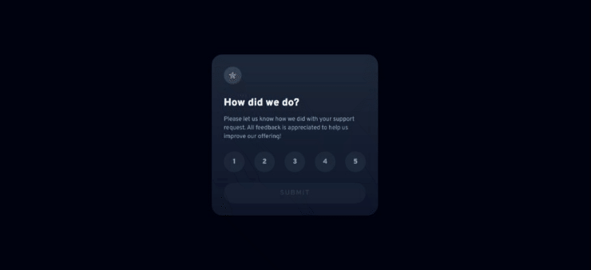

# Frontend Mentor - Interactive rating component solution

This is a solution to the [Interactive rating component challenge on Frontend Mentor](https://www.frontendmentor.io/challenges/interactive-rating-component-koxpeBUmI). Frontend Mentor challenges help you improve your coding skills by building realistic projects.

## Table of contents

-   [Overview](#overview)
    -   [The challenge](#the-challenge)
    -   [Screenshot](#screenshot)
    -   [Links](#links)
-   [My process](#my-process)
    -   [Built with](#built-with)
    -   [What I learned](#what-i-learned)
    -   [Continued development](#continued-development)
    -   [Useful resources](#useful-resources)
-   [Author](#author)
-   [Acknowledgments](#acknowledgments)

## Overview

Now this one was fun.

I created this component that uses custom styled radio buttons to get a rating from the user.

Once the user clicks on a rating, the "SUBMIT" button is "unlocked" letting the user submit their rating which is shown in a "Thank you" component.

It is built using React and Vite, styled using TailwindCSS and deployed on the internet using Netlify

### The challenge

Users should be able to:

-   View the optimal layout for the app depending on their device's screen size
-   See hover states for all interactive elements on the page
-   Select and submit a number rating
-   See the "Thank you" card state after submitting a rating

### Screenshot

### Links

-   Solution URL: [View on Github](https://github.com/Jeffreyon/rating-component)
-   Live Site URL: [Deployed on Netlify](https://637bfc69548fc207aea9537f--resplendent-baklava-edaffc.netlify.app/)

## My process

I tried Vite for the first time today, compared to CRA i didn't have any issues installing it using npm.

Plus it's fast

I built the core functionality first, then styling last. This workflow is saving me a lot of headache

The component consists of 5 custom radio buttons and manages a state called `rating` which is set once the user clicks on any radio button.

That rating state determines how the UI look in various ways

-   Set to nothing, React renders the submit button as disabled
-   Set to a rating, React passes the rating down to the radio buttons and the selected rating gets styled as "active"

When the user submits a rating, a function sets another state called `showing` which determines which card to show, the function sets the state to a different component thanking the user for their submission

Including the rating the user chose

After that, i installed TailwindCSS to style the project easily

I deployed it on Netlify so i can get a feel for enterprise platforms

### Built with

-   Vite - Frontend Toolchain
-   React - JS library
-   TailwindCSS - Utility-based CSS library
-   Mobile-first workflow

### What I learned

I learnt how to use a state to determine what classes to apply to a component

### Continued development

I think i need to work on a structure for my projects, for instance my jsx is bloated with Tailwind classes and they don't look readable or organized

Might be time i started learning styled-components

### Useful resources

-   [Devdocs.io](https://devdocs.io) - Best documetation tool, Devdocs helps by organizing code docs of various packages, languages and frameworks into one clean searchable interface. And it works offline too

## Author

-   Website - [Jeffrey Onuigbo](https://www.github.com/Jeffreyon)
-   Frontend Mentor - [@jeffreyon](https://www.frontendmentor.io/profile/Jeffreyon)
-   Twitter - [@jeffreyon\_](https://www.twitter.com/jeffreyon_)
